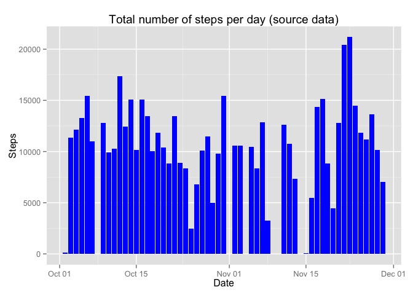
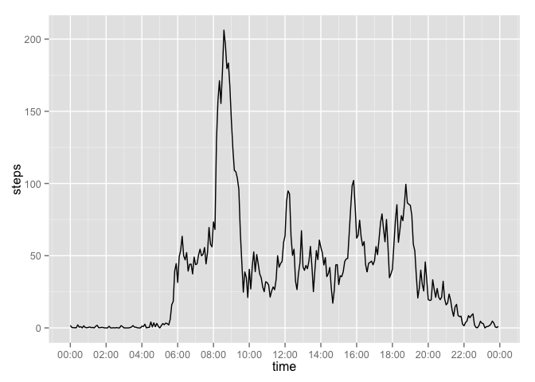
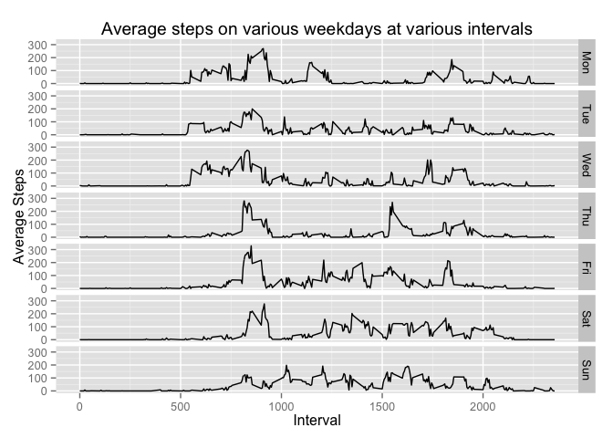
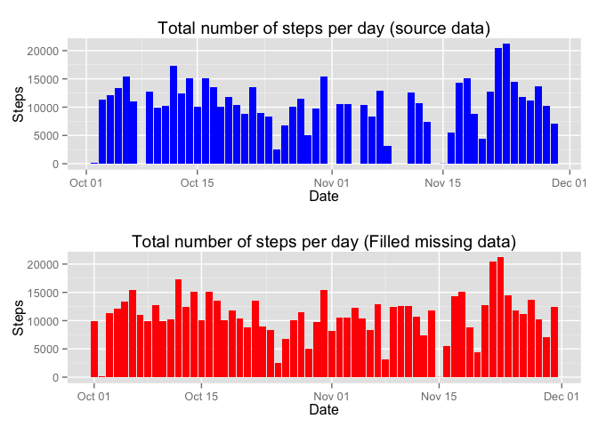
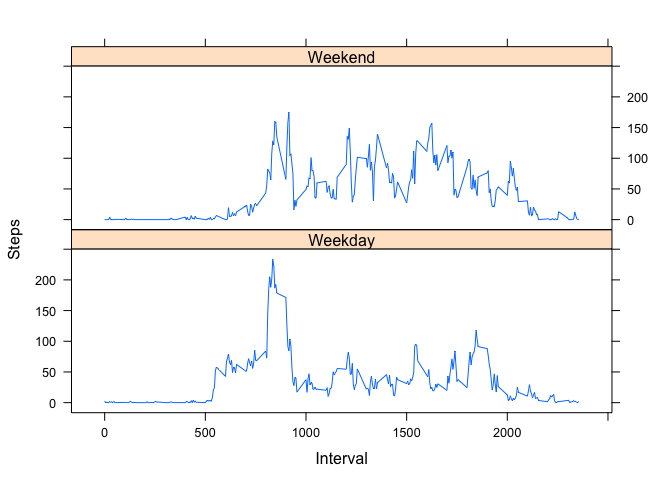

# Reproducible Research: Peer Assessment 1

# Reproducible Research Assignment

## Loading and preprocessing the data

### Set global options

```r
knitr::opts_chunk$set(echo=TRUE, eval=TRUE, warning=FALSE, message=FALSE)
```

### Load required packages

```r
library(lubridate)
library(ggplot2)
library(scales)
library(grid)
library(gridExtra)
library(dplyr)
library(lattice)
```

### Loading data

```r
datafile <- unz("activity.zip","activity.csv")
dtActivity <- read.table(
        file = datafile,
        header = TRUE,
        sep = ",",
        stringsAsFactors=FALSE)
```

### Preprocessing data

```r
dtActivity$datetime <-  paste(dtActivity$date, 
                              paste(dtActivity$interval %/% 100, 
                                    dtActivity$interval %% 100, 
                                    sep=":"))

dtActivity$datetime <- ymd_hm(dtActivity$datetime)
knitr::kable((head(dtActivity)))
```


 steps  date          interval  datetime            
------  -----------  ---------  --------------------
    NA  2012-10-01           0  2012-10-01 00:00:00 
    NA  2012-10-01           5  2012-10-01 00:05:00 
    NA  2012-10-01          10  2012-10-01 00:10:00 
    NA  2012-10-01          15  2012-10-01 00:15:00 
    NA  2012-10-01          20  2012-10-01 00:20:00 
    NA  2012-10-01          25  2012-10-01 00:25:00 


## What is mean total number of steps taken per day?

### Calculating data for histogram


```r
dtActSummary <- setNames(
        aggregate(
                steps~as.Date(date),
                dtActivity,
                sum,
                na.rm = TRUE),
        c("date","steps")
        )
```

### Plotting the Historgram

```r
xlabel <- "Date"
ylabel <- "Steps"
title  <- "Total number of steps per day (source data)"
plotdata <- dtActSummary 

plot1 <- ggplot(plotdata,aes(x=date,y=steps)) + 
        geom_bar(stat="identity", fill = "blue") + 
        xlab(xlabel) +
        ylab(ylabel) +
        ggtitle(title)

print(plot1)
```

 

### Mean and Median of the total number of steps taken per day

```r
meanMedian <- c(mean = mean(dtActSummary$steps),
                median = median(dtActSummary$steps))
knitr::kable(meanMedian)
```


-------  ---------
mean      10766.19
median    10765.00
-------  ---------

The mean number of steps taken per day is 1.0766189\times 10^{4}

## What is the average daily activity pattern?

### Calculation of the Average Activity Pattern

```r
avgActPattern <- aggregate(steps~interval, dtActivity, mean, na.rm = TRUE)

avgActPattern$time <- as.POSIXct(with(avgActPattern,
                                      paste(interval %/% 100, 
                                            interval %% 100, 
                                            sep=":")),
                                 format="%H:%M")
```

### Plotting the data

```r
plot2 <- ggplot(avgActPattern, aes(x= time,y= steps)) + 
        geom_line() + 
        scale_x_datetime (breaks = date_breaks("2 hour"),
                          labels = date_format("%H:%M"))
print(plot2)
```

 

### 5-minute interval contains the max number of steps

```r
maxSteps<- with(avgActPattern,
                avgActPattern[steps == max(steps),])

knitr::kable(maxSteps)
```

       interval      steps  time                
----  ---------  ---------  --------------------
104         835   206.1698  2015-03-16 08:35:00 

Interval 835 contains the maximum number of steps


## Imputing missing values

### Number of missing values in the dataset

```r
missingVal <- aggregate(count ~ date, 
                        cbind(dtActivity[is.na(dtActivity$steps),], count=c(1)),
                        sum,
                        na.rm = FALSE)

missingVal$weekday <- weekdays(as.Date(missingVal$date), 
                               abbreviate=TRUE)

knitr::kable((missingVal[,c(1,3,2)]))
```


date         weekday    count
-----------  --------  ------
2012-10-01   Mon          288
2012-10-08   Mon          288
2012-11-01   Thu          288
2012-11-04   Sun          288
2012-11-09   Fri          288
2012-11-10   Sat          288
2012-11-14   Wed          288
2012-11-30   Fri          288

Determining the count of the missing records vis-a-vis total records.

```r
missingdata <- sum(missingVal$count)
totaldata   <- nrow(dtActivity)
```

The total count of missing measures is 2304 out of 17568.

### Creating a new dataset

####Step 1: Create a reference dataset to observe the pattern

```r
refDs <- aggregate(steps ~ interval + weekdays(datetime, abbreviate=TRUE), 
                   dtActivity,
                   FUN=mean,
                   na.rm=TRUE)

colnames(refDs) <- c("interval","weekday","average_steps")

refDs$weekday <- factor(refDs$weekday,
                        levels = c("Mon","Tue","Wed","Thu","Fri","Sat","Sun"))

xlabel <- "Interval"
ylabel <- "Average Steps"
title  <- "Average steps on various weekdays at various intervals"
plotdata <- refDs 
```

#### Reference data plot

```r
plot3<- ggplot(plotdata,
               aes(x = interval, y = average_steps)) + 
        geom_line() + 
        xlab(xlabel) +
        ylab(ylabel) +
        ggtitle(title) +
        facet_grid("weekday ~ .")

print(plot3)
```

 

#### Step 2: Create the new dataset with filled values

```r
dtActivity$weekday <- weekdays(dtActivity$datetime, abbreviate=TRUE)
newDs <- merge(x= dtActivity, y= refDs, by=c("weekday","interval"), all.x = TRUE)
newDs <- newDs[with(newDs, order(date,interval)),]
newDs$filled_steps <- ifelse(is.na(newDs$steps), newDs$average_steps, newDs$steps)
```


### Creating a Histogram
#### Calculating the dataset for the Histogram

```r
dtActSummaryfixed <- setNames(
        aggregate(
                filled_steps ~ as.Date(date),
                newDs,
                sum,
                na.rm = TRUE),
        c("date", "steps")
        )
```

#### Plotting the histogram of the original data as well as the fixed data

```r
xlabel <- "Date"
ylabel <- "Steps"
title  <- "Total number of steps per day (Filled missing data)"
plotdata <- dtActSummaryfixed 

plot4 <- ggplot(plotdata, aes(x=date, y=steps)) + 
        geom_bar(stat="identity", fill = "red") + 
        xlab(xlabel) +
        ylab(ylabel) +
        ggtitle(title)

grid.arrange(plot1, plot4, nrow=2)
```

 

#### Detemining the impact of imputing missing data on the estimates of the total daily number of steps

```r
meanMedianfixed <- c(mean = mean(dtActSummaryfixed$steps),
                     median = median(dtActSummaryfixed$steps))

meanMedianDiff <- rbind (Original = meanMedian, 
                         Fixed = meanMedianfixed, 
                         Difference = meanMedianfixed - meanMedian)

knitr::kable(meanMedianDiff)
```

                     mean   median
-----------  ------------  -------
Original      10766.18868    10765
Fixed         10821.20960    11015
Difference       55.02092      250


## Are there differences in activity patterns between weekdays and weekends?

### Creating a new Factor Variable to determine whether a given date is a Weekday or Weekend

```r
diffByDaytype <- aggregate(
        steps ~ daytype +  interval,
        with(dtActivity,
             data.frame(daytype = factor(
                     ifelse(weekdays(as.Date(date)) %in% 
                                    c("Sunday","Saturday"),
                            "Weekend",
                            "Weekday")
                     ),
                     interval,
                     steps
                     )
             ),
        FUN = mean,
        rm.na = TRUE
        )
```

### Plotting the result (Weekdays & Weekends shown in two different panels)

```r
xlabel   <- "Interval"
ylabel   <- "Steps"
title    <- "Difference based on Weekdays or Weekends"
plotdata <- diffByDaytype 

plot5<- xyplot(plotdata$steps ~ plotdata$interval | plotdata$daytype, 
       layout = c(1, 2), 
       type = "l", 
       xlab = xlabel, 
       ylab = ylabel,
       title = title)

print(plot5)
```

 

Yes, there are differences in the activity patters between weekdays and weekends.
